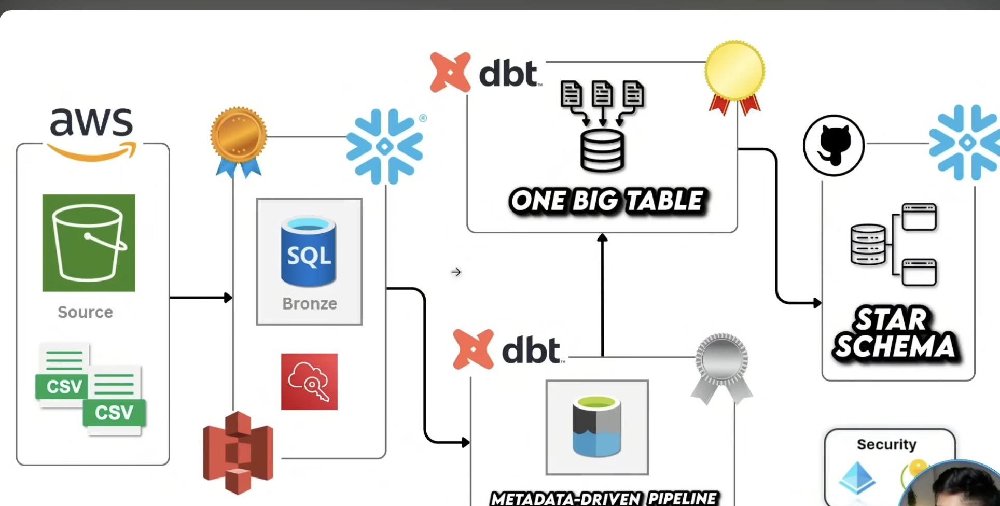
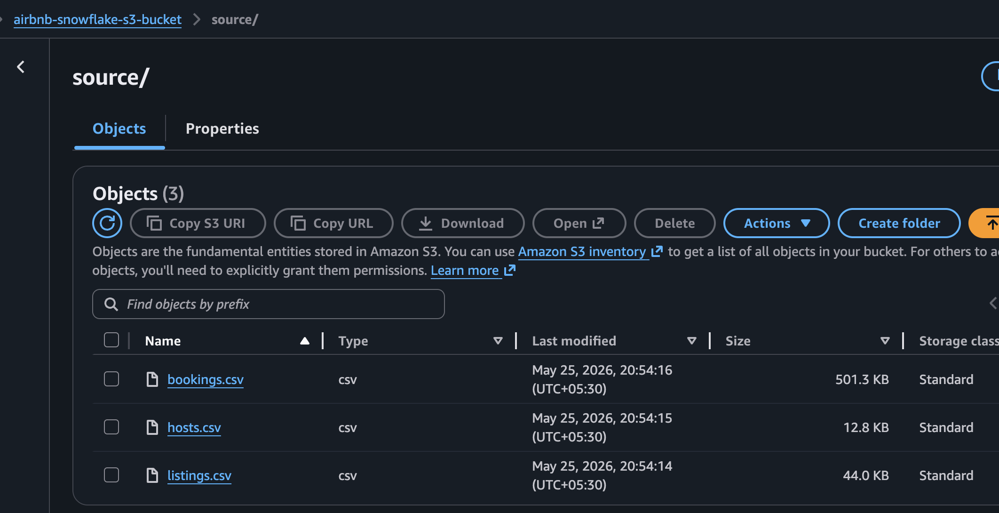
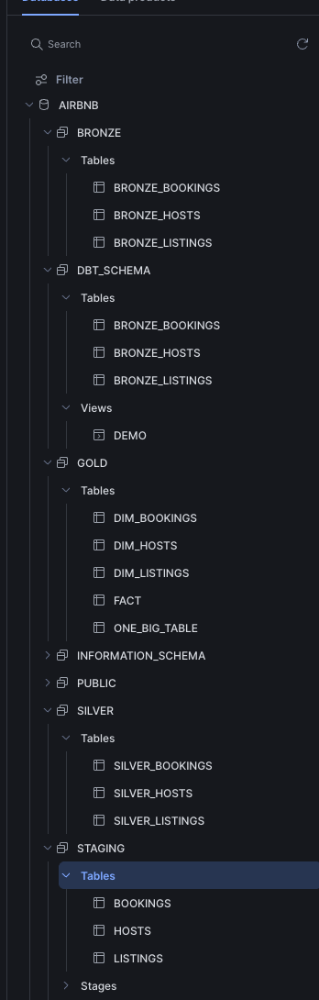

# 🏠 Airbnb Snowflake DBT AWS Portfolio Project

## 📋 Overview
This portfolio project implements a complete end-to-end Airbnb data engineering pipeline using modern cloud data tooling. It demonstrates data warehousing and transformation best practices with **Snowflake**, **dbt**, and **Python**, using a medallion architecture that moves raw Airbnb staging data through a Bronze → Silver → Gold pipeline.

The repo includes raw input datasets, dbt models for staged ingestion, enrichment logic, analytics consolidation, and data quality validation.

## 🏗️ Architecture



### Data Flow

```text
Source Data (CSV) → Snowflake Staging → Bronze Layer → Silver Layer → Gold Layer
                                    \\                 \\                \\                \\n                                      Raw Tables      Cleaned Data      Enriched Data      Analytics Ready
```

### Technology Stack

- **Cloud Data Warehouse**: Snowflake
- **Transformation Layer**: dbt (Data Build Tool)
- **Python**: 3.12+
- **Version Control**: Git
- **Data Input**: CSV files in `inputs/`
- **Key dbt Patterns**: Incremental models, snapshots, reusable macros, source tests, Jinja templating

## S3 



## Snowflake 



## 📊 Data Model

### Medallion Architecture

#### 🥉 Bronze Layer (Raw Data)
Raw staging data is ingested with minimal transformation to preserve source fidelity.

- `bronze_bookings` – raw booking transactions
- `bronze_hosts` – raw host information
- `bronze_listings` – raw listing records

#### 🥈 Silver Layer (Cleaned & Enriched Data)
The Silver layer standardizes fields, computes derived metrics, and prepares data for analytics.

- `silver_bookings` – calculates `TOTAL_AMOUNT` and enforces incremental loading
- `silver_hosts` – normalizes host names and categorizes response quality
- `silver_listings` – standardizes listing details and tags pricing

#### 🥇 Gold Layer (Analytics-Ready)
The Gold layer joins the Silver datasets into consolidated analytics models.

- `one_big_table` – a denormalized combined model for analytics
- `fact` – a fact-style model representing business-ready data
- `ephemeral/` models – intermediate transformations used only during compilation

### Snapshots (SCD Type 2)
This repository includes snapshot configurations to track historical changes over time.

- `dim_bookings` – historical booking changes
- `dim_hosts` – historical host profile changes
- `dim_listings` – historical listing changes

## 📁 Project Structure

```text
Airbnb_Snowflake_DBT_AWS/
├── README.md
├── pyproject.toml
├── main.py
├── inputs/
│   ├── bookings.csv
│   ├── hosts.csv
│   └── listings.csv
├── DDL/
│   ├── ddl.sql
│   └── resources.sql
└── airbnb_aws_snowflake_dbt_project/
    ├── dbt_project.yml
    ├── profiles.yml
    ├── models/
    │   ├── bronze/
    │   │   ├── bronze_bookings.sql
    │   │   ├── bronze_hosts.sql
    │   │   └── bronze_listings.sql
    │   ├── silver/
    │   │   ├── silver_bookings.sql
    │   │   ├── silver_hosts.sql
    │   │   └── silver_listings.sql
    │   ├── gold/
    │   │   ├── fact.sql
    │   │   ├── one_big_table.sql
    │   │   └── ephemeral/
    │   │       ├── bookings.sql
    │   │       ├── hosts.sql
    │   │       └── listings.sql
    │   └── sources/
    │       └── sources.yml
    ├── macros/
    │   ├── generate_schema_name.sql
    │   ├── multiply.sql
    │   ├── tag.sql
    │   └── trim.sql
    ├── analyses/
    │   ├── explore.sql
    │   ├── for.sql
    │   └── if_else.sql
    ├── snapshots/
    │   ├── dim_bookings.yml
    │   ├── dim_hosts.yml
    │   └── dim_listings.yml
    ├── tests/
    │   └── source_tests.sql
    └── models/properties.yml
```

## 🚀 Getting Started

### Prerequisites

1. **Snowflake account** and access to the target Snowflake environment
2. **Python 3.12+**
3. **dbt Core** and **dbt-snowflake**
4. Local CSV files in `inputs/` or staged data loaded into Snowflake staging tables

### Installation

```bash
python -m venv .venv
source .venv/bin/activate
pip install dbt-core dbt-snowflake
```

### Configure Snowflake Connection
Update `airbnb_aws_snowflake_dbt_project/profiles.yml` with your Snowflake credentials.

```yaml
airbnb_aws_snowflake_dbt_project:
  outputs:
    dev:
      account: <YOUR_ACCOUNT>
      database: AIRBNB
      password: <YOUR_PASSWORD>
      role: ACCOUNTADMIN
      schema: dbt_schema
      threads: 1
      type: snowflake
      user: <YOUR_USER>
      warehouse: COMPUTE_WH
  target: dev
```

### Load Source Data

Load the raw CSV files into Snowflake staging tables, for example:

- `AIRBNB.STAGING.BOOKINGS`
- `AIRBNB.STAGING.LISTINGS`
- `AIRBNB.STAGING.HOSTS`

You can use the `DDL/ddl.sql` script as a starting point for table creation.

## 🔧 Usage

```bash
cd airbnb_aws_snowflake_dbt_project

# Verify connection
dbt debug

# Run all models
dbt run

# Run only Bronze models
dbt run --select bronze.*

# Run only Silver models
dbt run --select silver.*

# Run only Gold models
dbt run --select gold.*

# Execute source tests
dbt test

# Run snapshots
dbt snapshot

# Generate dbt docs
dbt docs generate
dbt docs serve

# Build end-to-end workflow
dbt build
```

## 🎯 Key Features

### 1. Incremental Loading

Bronze and Silver models use incremental materialization to process only new or updated rows.

```sql
{{ config(materialized='incremental') }}

  WHERE CREATED_AT > (
    SELECT COALESCE(MAX(CREATED_AT), '1900-01-01')
    FROM {{ this }}
  )

```

### 2. Custom Macros

Reusable SQL macros simplify recurring transformation logic:

- `multiply()` for numeric calculations
- `tag()` for price categorization
- `generate_schema_name()` for schema naming rules
- `trim()` for string normalization

### 3. Dynamic SQL & Joins

The `one_big_table` model uses Jinja loops to maintain clean join logic and reduce repeated SQL.

### 4. Slowly Changing Dimensions

Snapshots are configured for historical tracking of bookings, hosts, and listings.

### 5. Data Quality

Source-level tests verify important keys like `booking_id`, `listing_id`, and `host_id` are not null.

## 📈 Data Quality Strategy

- Source definitions in `models/sources/sources.yml`
- Not-null tests for primary identifiers
- Incremental model validation through `dbt test`
- Snapshot auditing for historical changes

## 🔐 Security & Best Practices

- Do not commit credentials or sensitive data in `profiles.yml`
- Use environment variables for Snowflake secrets if possible
- Keep model logic modular and reusable
- Use incremental models for large datasets
- Employ snapshots for change history
- Maintain clear schema separation across Bronze/Silver/Gold layers

## 📌 Portfolio Highlights

- Demonstrates practical dbt orchestration for Airbnb analytics
- Uses Snowflake as the core data warehouse
- Builds a strong Bronze/Silver/Gold medallion architecture
- Includes incremental loading, snapshots, and data quality tests
- Uses macros, Jinja templating, and reusable transformation patterns

## 🔮 Future Improvements

- Add more dbt tests and schema validations
- Expand Gold layer with KPI metrics and date dimension support
- Add generated `dbt docs` and model documentation pages
- Implement automated CI/CD for dbt runs and testing
- Add Snowflake best-practice clustering and performance tuning
